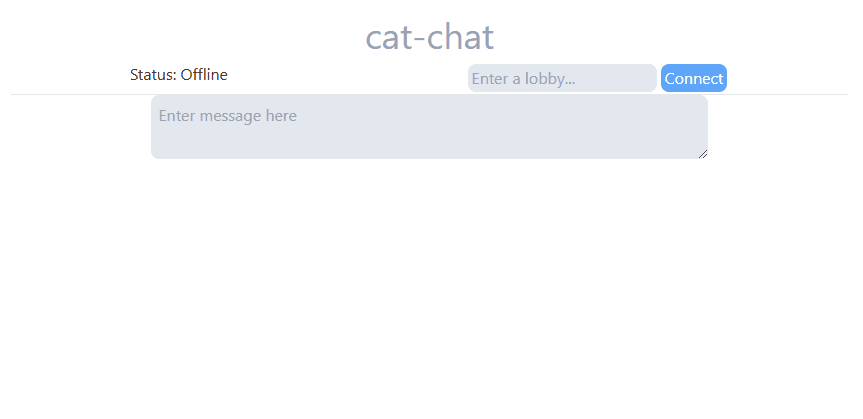

# cat-chat

A chat client and server that can handle millions of clients at once with the ability to choose different chat lobbies to connect to

## Stack

Backend

- Elixir
- Cowboy (for websockets)
- Jason (for parsing JSON)

Frontend

- React (Vite)
- TailwindCSS

## Backend

Build and run the Dockerfile, or run `mix run --no-halt` to start the backend.

## Frontend

Run `npm run build` to get index.html.
